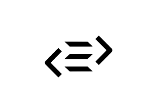

import {Appear, Head} from 'mdx-deck';
import {AppearList, Img} from './components';
import { FullScreenCode, Split } from 'mdx-deck/layouts';
import {FullScreenCodeWithTitle} from './layouts';


export {default as theme} from './theme.js';

# Intro to Reason

---

## About Me

- Front-End Engineer at AutoGravity
- Twitter: @benjamminj
- Medium blog

<!-- TODO -- add pic -->

---


---


---

# How do we keep code bases from becoming complex?

---

<AppearList>
  <li>Unit tests 🚨</li>
  <li>Linters, Formatters ✅</li>
  <li>Peer review 👀</li>
  <li>Types 🔓</li>
</AppearList>

---

##  ⚠️️️️️⚠️⚠️ _Quick Disclaimer_ ⚠️️️️️⚠️⚠️

---

# Types & JavaScript

<br />
<Appear>
  
  
  
  
  
  
  
</Appear>

---

> "Reason lets you write simple, fast and quality type safe code while leveraging both the JavaScript & OCaml ecosystems."

---


<AppearList>
  <li>Syntax extension of the OCaml programming language</li>
  <li>Same creator as React</li>
  <li>Super fun! 🎉</li>
</AppearList>

---

# What's this OCaml thing?

---

> "OCaml is an industrial strength programming language supporting functional, imperative and object-oriented styles"

---

<AppearList>
  <li>Immutable & functional by default</li>
  <li>Still allows imperative code</li>
  <li>Rock solid type system with awesome inference</li>
</AppearList>

---

# Syntax

---
export default FullScreenCodeWithTitle

## Functions

```reason
let add = (first, second) => first + second;

add(1, 2) /* 3 */
```

---
export default FullScreenCodeWithTitle

## All functions are automatically curried!

```reason
let mult = (a, b) => a * b;
let multCurries = a => b => a * b;

let times3 = mult(3);
let num = times3(4);
```
---
export default FullScreenCodeWithTitle

## Labelled arguments

```reason
let addText = (~addition, ~text) => text ++ addition;

addText(~addition="test", ~text="TODO -- this is a ")
/* "TODO -- this is a test" */
```
---
export default FullScreenCodeWithTitle

### Records

<!-- TODO -- better ex. -->

```reason
type myRecord = {
  a: int,
  b: string
};

let record = {
  a: 3,
  b: 4,
}
```

---
export default FullScreenCodeWithTitle

### Lists & Arrays

```reason
/* Lists are immutable & fast at adding items */
let list = [1, 2, 3, 4];
let addedList = [0, ...list];

/* By contrast, arrays are mutable and faster at random access */
let arr = [|"array", "syntax", "feels", "great,", "right?"|];
arr[3] = "a little strange,";

/* arr = [|"array", "syntax", "feels", "a little strange,", "right?"|] */
```

---
export default FullScreenCodeWithTitle

### Variant!

```reason
let letter = 
  | A
  | B
  | C(int);

let a = C(43);
```

---
export default FullScreenCodeWithTitle

### Pattern Matching!

```reason
/* TODO -- better example? */
let applyLetter = (letter) => 
  switch(letter) {
    | A => "the letter is A"
    | B => "the letter is B"
    | C(val) => "the letter C was passed with the value " ++ string_of_int(val)
  }

applyLetter(C(23));
```

---
export default FullScreenCodeWithTitle

### More Pattern Matching!

```reason
let getPostRecommendation = (posts) => {
  switch(posts) {
    | [] => "there aren't any posts!"
    | [articleName, ..._rest] when articleName == "intro to reason" => 
      "check this out! It's awesome!"
    | [articleName] => "check out " ++ "articleName"
    | [firstName, secondName, ..._rest] => 
      "try" ++ firstName ++ " or " ++ secondName
  }
};

getPostRecommendation(["intro to reason"]);
```
---
export default FullScreenCodeWithTitle

## Pipes

```reason
let add3 = (a) => a + 3;
let multBy4 = (a) => a * 4;

let endResult = 3 |> add3 |> multBy4;
/* multBy4(add3(3)) */

```
---
export default FullScreenCodeWithTitle

## Modules

```reason
/* Every file also doubles as a module! */
let myFn = (a) => FileName.map();

/* You can also declare internal modules */
module Math = {
  let add = (a, b) => a + b;
  let mult = (a, b) => a * b;
  let div = (a, b) => a / b;
}

let sum = Math.add(1,2);
```

---

# Did I mention React bindings???

---
<!-- TODO -- add a dank GIF here or something -->

---

## Stateless Components

```jsx
let component = ReasonReact.statelessComponent("Button");

let make = (~onClick, ~color, ~text, _children) => {
  ...component,
  render: _self => {
    <button onClick style={ReactDOMRe.Style.make(~background=color, ())}>
      {ReasonReact.string(text)}
    </button>
  }
}
```

---

## Stateful (Reducer) Components

```jsx
type state = int;

type action =
  | Increment(int)
  | Decrement;

let component = ReasonReact.reducerComponent("Counter");

let make = (~initialCount=0, _children) => {
  ...component,
  initialState = () => initialCount,
  reducer = (action, state) =>
    switch(action) {
      | Increment(amount) => ReasonReact.update(state + amount)
      | Decrement => ReasonReact.update(state - 1)
    },
  render: self => 
    <div>
      <button onClick={_ev => self.send(Increment(1))}>Increment!</button>
      <button onClick={_ev => self.send(Increment(5))}>Increment by 5!</button>
      <button onClick={_ev => self.send(Decrement)}>Decrement!</button>

      <h1>{self.state}</h1>
    </div>
};
```

---


# The end